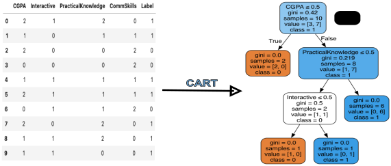

##CART (Classification And Regression Tree) Algorithm

CART Algorithm uses the Gini Index measure to analyse numerical data. 



**Figure 1:** Illustration of a Classification Tree produced by CART scikit-learn implementation. 


This repository contains the material, data, and slides used for the lecture on CART by @Lemerleau. 


The repo is organised as follows:

- [data](data/): The CSV data files used for the lecture tutorial:
	-  [job.csv](data/jobs.cs)
	-  [diabetes.csv](data/diabetes.csv): For more details, please refer to the Python notebook [Pima Indians Diabetes Datasets](https://www.kaggle.com/datasets/uciml/pima-indians-diabetes-database)

- [docs] (docs): It contains the material used to prepare this class. 
- [images](images/): It contains the graphics in the slides and the images saved from the Python Notebook.
- [codes](src/): It contains the Python script for the Regression Problem CART implementation.

# Requirements
To be able to run different algorithms, the following softwares are required:

- [Python version 3.11.3](https://www.python.org/downloads/release/python-3113/) or higher
- Numpy
- Pandas
- Scipy
- [scikit-learn](https://scikit-learn.org/stable/): Machine Learning Python Library
- matplotlib: for the plotting part.
- graphviz: `` brew install graphviz	`` on MAC

To install all requirements automatically, including the setup of a conda environment called `CART` via miniconda, type the following command:

```
make requirements
```
Please use the following command for `pip` installation. 

```
pip install -r requirements.txt
```

The installation was tested on the following operating systems:

* MacOS Mojave
* Debian Xfce 4.12

## How to run the program?
First, please clone the git repo using the command:

```
$ git clone [repo link](#)
$ cd CART
$ make requirements //In case the dependencies are not yet installed.  
$ cd code/
$ python codes/cart_regression.py
```

For more details about the Classification example in class, please look at the Python Notebook: [CART Notebook](notebooks/CART.ipynb)

## Contact
If you have any questions about this class's content or problems running this code, please contact me at [Dr. Nono Saha](mailto:cyrillecardinale@gmail.com.?subject=[GitHub]%20CART%20Lecture%20Material) 


## References
<a id="1">[1]</a> 
Breiman, L., Friedman, J.H., Olshen, R.A. and Stone, C.J. (1984), Classification And Regression Trees, Chapman & Hall/CRC

<a id="2" href="https://www.datacamp.com/tutorial/decision-tree-classification-python?dc_referrer=https%3A%2F%2Fwww.google.com%2F">[2] Decision Tree Classification with Python</a> 

<a id="3" href="https://www.math.snu.ac.kr/~hichoi/machinelearning/lecturenotes/CART.pdf">[3]</a>
Hyeong In Choi (2017), Lecture 9: Classification and Regression Tree (CART), Seoul National University


